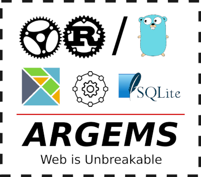

# ARGEMS

  

### What is ARGEMS? 
**ARGEMS** is a web stack which consists of Actix-Rust/Go, Elm, Microservices, and SQLite. The objective of **ARGEMS** is to utilize technologies which emphasizes on containment, static typedness, independence, and fault-free-error-first features in order to create a robust web app which *doesn't break often*.

### Key points of ARGEMS
1. Containment, binary-based output
2. Error-first principle, assume that every critical action can fail (i.e. string to int conversion, HTTP requests)
3. Modularism & interoperability, can be connected to other apps which use the same open standard, not just other ARGEMS apps 

### Choice of technology
1. **Actix-Rust**  
Actix-Rust is the main choice of the ARGEMS stack, as the language is blazing fast, has close-to-zero runtime bloat/overhead, has error-first feat (with Result/Option), and has abstractions high enough to create a hackable web application--combined with the Actix Web runtime. Due to the absence of a garbage collector and the language itself utilizes new concepts like macros/code generation for meta-programming, ownership, Result/Option for error handling, and fearless concurrency, it might be hard to understand for people who are new to programming [(See this article for some impressions of Rust)](https://www.freecodecamp.org/news/8-things-i-learned-from-4000-rust-developers/), which brings us to...

2. **Go**  
Go is an alternative to Rust on the ARGEMS stack. Go is still an excellent choice for the ARGEMS stack as the ARGEMS stack do not really emphasize on performance but it's more about hard-to-break and fault-free feats. Go is easier to learn than Rust for new programmers because it focuses on all the characteristics of [efficient compilation, efficient execution, and ease of programming](https://golang.org/doc/faq#creating_a_new_language) but with the additional runtime overhead of a garbage collector and reflection system.

3. **Elm**  
Despite often being pronounced dead, the [Elm community](https://elm-lang.org/community) is pretty much still alive until now, mostly on Slack and Discourse. Elm is a declarative, robust (no runtime exceptions!) language which is made specifically for creating web interfaces which is transpiled to Javascript and also has excellent interoperability with Javascript. After being successfully transpiled, Elm apps are pretty much expected to run forever correctly--with the exception of server outages.

4. **Microservices**  
Microservices is one of the main features of the ARGEMS stack. Each main runtime alternative  has a lightweight, embedded, concurrent asynchronous web server which consumes very little RAM, which enables us to deploy many ARGEMS-powered apps into a single server.

5. **SQLite**  
SQLite is chosen for the data storage system in ARGEMS because it offers the solution of a true contained, independent database solution that *just works*. Import/Exporting the database is as easy as copy and pasting files.

### Pros of ARGEMS stack
1. Apps produced are very lightweight and easy to deploy (Just run `./app`)
2. Practically unbreakable, except for server outages
3. Modular
4. Has Rust/Go alternative

### Cons of ARGEMS stack
1. Technologies are more obscure and not well-known like PHP, Javascript, Python, or Java
2. Needs a paradigm shift. Programmers who are used to object-oriented, imperative, and try/catch based error catching languages may need to readjust their programming style before getting comfortable with ARGEMS as ARGEMS is a complete opposite of these principles
3. Huge learning overhead. Rust and Elm are notorious for having a very steep learning curve

### ARGEMS is suitable for
1. Small, interactive web app which needs many people to access but does not really need very big storage
2. Apps deployed in a virtual private server
3. Administrator management page

### ARGEMS may not be suitable for
1. Blogs
2. Apps which needs gigabytes of storage

## Apps made in ARGEMS stack
1. [Monty](https://github.com/vmasdani/monty), a monthly subscription calculator with live currency exchange rate
2. [TWIoT (Third-world Internet of Things)](https://github.com/vmasdani/twiot), compilation of hacky IoT codes
